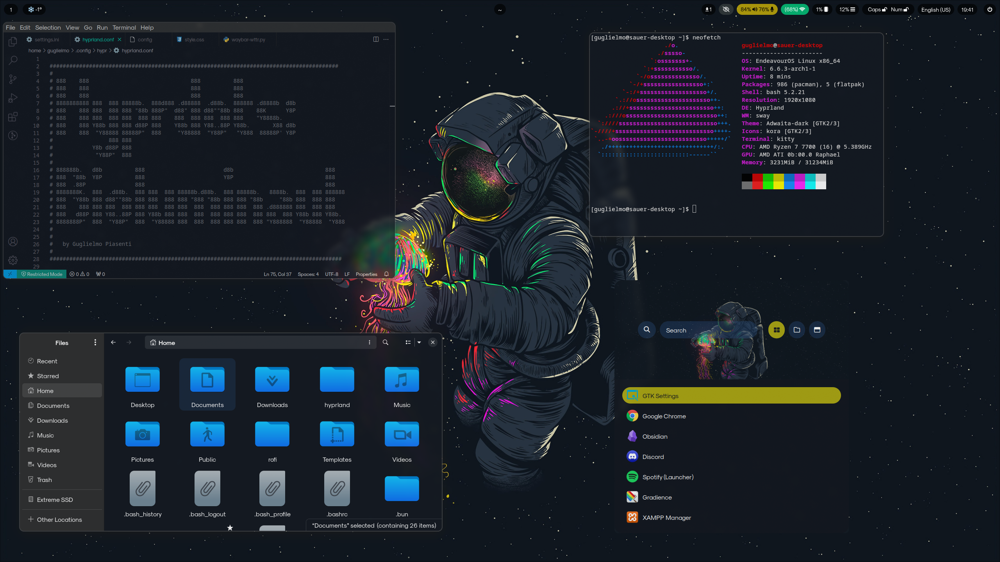

# Hyprland Readme


EndeavourOS X Hyprland - Bioluminaut - by Guglielmo Piasenti



Welcome! This is a comprehensive guide on how to install Hyprland and use my dotfiles.
If I forgot any step or you feel unsure about something written in this guide, feel free to check out the official hyprland guide at : https://wiki.hyprland.org/Getting-Started/Master-Tutorial/

I started from EndeavourOS with no de. This is how you can do it too: 
# EndeavourOS Installation Guide (Without DE)

This guide covers installing EndeavourOS without a pre-installed Desktop Environment.

## Pre-requisites

- A bootable USB drive with EndeavourOS ISO.
- Basic understanding of Linux commands.

## Installation Steps

1. **Create a Bootable USB**
   - Download the EndeavourOS ISO from [the official website](https://endeavouros.com/download/).
   - Use a tool like Rufus, dd, Balena Etcher or RaspberryPI imager, to create a bootable USB.

2. **Boot from USB**
   - Insert the USB into your computer.
   - Reboot and press the key for boot options (commonly F12, F2, ESC, or DEL).
   - Select the USB drive from the boot menu.

3. **Begin Installation**
   - Once booted, select "Boot: EndeavourOS x86_64 UEFI CD".
   - You will be greeted with the EndeavourOS live environment.

4. **Start the Installer**
   - In the live environment, find and start the "Install EndeavourOS" application.

5. **Follow Installation Steps**
   - Choose your language and click *Next*.
   - Connect to the internet if not already connected.
   - Update the installer if prompted.

6. **Select Location and Keyboard Layout**
   - Choose your location and keyboard layout.
   - Click *Next* to proceed.

7. **Partitioning**
   - For a fresh installation, select "Erase disk" and then "Next".
   - Advanced users can opt for manual partitioning.

8. **Choose Your Desktop Environment**
   - When prompted to select a Desktop Environment, **uncheck all options**.
   - This will install EndeavourOS without a DE.
   - Click *Next*.

9. **Create User Account**
   - Enter your username, computer's name, and a strong password.
   - Decide if you want to use the same password for the administrator account.
   - Click *Next*.

10. **Review and Install**
    - Review your settings.
    - Click *Install Now*.
    - Confirm the changes to disks if prompted.

11. **Installation Process**
    - Wait for the installation to complete. This may take a while.

12. **Reboot**
    - Once installation is complete, click *Restart Now*.
    - Remove the USB drive when prompted.

13. **First Boot**
    - After rebooting, you'll enter the command-line interface of EndeavourOS.
    - Log in with your created username and password.

## Post-Installation

- Update your system: `sudo pacman -Syu`

Congratulations! You have successfully installed EndeavourOS without a Desktop Environment.

# Hyprland installation Process:
## 1 - Install Git and Base-devel 

If you haven’t already, you need to install `git` and the `base-devel` group, which includes tools required for building from source:

```
sudo pacman -S git base-devel
```

## 2 - **Install Hyprland from AUR**: 

Once `yay` is installed, you can install Hyprland directly from the AUR:

```
yay -S hyprland-git  # For the latest source
# or
yay -S hyprland      # For the latest release source
# or
yay -S hyprland-bin  # For the precompiled latest release
```

I suggest going with **hyprland-git**

### 3 - Install Kitty:
```
sudo pacman -S kitty
```
## 4 -  Running Hyprland: 
After installation, you can start Hyprland directly from a TTY by running the command `hyprland`. At this point you'll be inside of the hyprland session! You can open a terminal with SUPER + Q.    
## 5 - Configuration: 
Copy the example configuration file to your home directory and adjust as needed:
```
cp /usr/share/doc/hyprland/examples/hyprland.conf ~/.config/hyprland/
```


# Required packages
```
yay -S polkit gnome pipewire wireplumber xdg-desktop-portal-hyprland qt5-wayland qt6-wayland nwg-look-bin swaync cliphist wl-clipboard nautilus gradience waybar hyprpaper rofi flatpak ttf-font-awesome swaylock-effects sddm-git grim slurp brightnessctl swayidle hyprpicker
```
### Icons 
Kora icons pack from gnome-look.org:  https://www.gnome-look.org/p/1256209


# Installing Waybar

If you don't have a Waybar configuration folder in `~/.config`, you'll need to create one and add a configuration file.

1. **Create Configuration Directory**: First, create the Waybar directory within `.config`:
   ```bash
   mkdir -p ~/.config/waybar
   ```

2. **Default Configuration Files**: Waybar's default configuration files are generally located in `/usr/share/waybar/`. You can copy these to your `~/.config/waybar` directory:
   ```bash
   cp /usr/share/waybar/config ~/.config/waybar/
   cp /usr/share/waybar/style.css ~/.config/waybar/
   ```

3. **Edit Configuration**: You **have to edit the configuration files by changing any reference from sway with hyprland** to match your setup. Open the `config` and `style.css` files with a text editor to adjust any settings:
   ```bash
   nano ~/.config/waybar/config
   nano ~/.config/waybar/style.css
   ```

   Within the `config` file, you can configure various modules. in the style.css you can adjust the look.

4. **Check Module Configurations**: Make sure the modules in the Waybar configuration file are compatible with your environment and that all paths and commands are correct.

5. **Install Additional Software**: Some modules may require additional software to function correctly.

6. **Start Waybar**: After setting up the configuration, you can start Waybar with the following command:
   ```bash
   waybar
   ```

7. **Autostart Waybar: If you want Waybar to start automatically, you can add the following line to your `hyprland.conf` configuration file:
   ```bash
   exec_once = waybar
   ```

# Authentication Agent

_Starting method:_ manual (`exec-once`) 

In your hyprland.conf:

`exec-once = /usr/lib/polkit-gnome/polkit-gnome-authentication-agent-1`

# SDDM

If you followed the guide till now you have already installed, otherwise do:

```
yay -S sddm-git
```


1. **Enable SDDM**:
   ```sh
   sudo systemctl enable sddm
   ```

2. **Reboot Your System**:
   ```sh
   reboot
   ```

After rebooting, SDDM should be operational as your display manager, presenting a graphical login interface at startup.


# You should be good to go!

Now you can start customizing your own Hyprland on your own, or feel free to copy and paste from my dotfiles if you like my work. If you want to cooperate with me just contact me on Linkedin. Feel free to use it, copy it, fork it. That's the beauty of open source and sharing!

In case I forgot to mention something or there are any errors please let me know!
